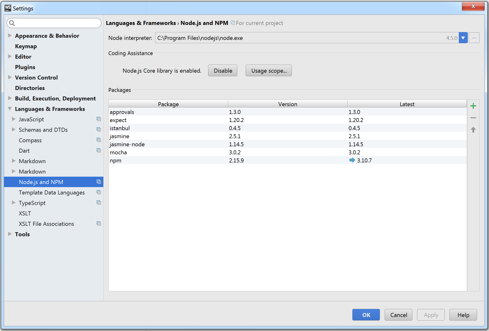

## Webstorm IDE
[WebStorm](https://www.jetbrains.com/webstorm/specials/webstorm/webstorm.htm) is a great IDE with a free 30 day trial.
Out of the box, WebStorm provides IDE integration for Mocha, but not Jasmine. In this project you can still run Jamsine
tests through WebStorm via the `Jasmine` run configuration but this will run in a terminal window rather than use WebStorm unit test view.

### Enable Node.js
To run tests from the IDE you may need to enable `Node.js` if it is not already enabled.

On a Mac you do this by pressing **&#8984;,** and then selecting `Node.js and NPM` and press the `Enable` button if you see that Node.js is not enabled. The window should like the shown below:

On Windows you do this by entering `Ctrl+Alt+S`, selecting `Node.js and NPM` and press the `Enable` button if you see that Node.js is not enabled. The window should like the one shown below:

### Running Tests
Right click on any `spec.js` file and select "Run".

### Viewing Markdown Files
To view the kata descriptions it is recommended that you install the 'Markdown Support' plugin. Refer to the [Enabling and Disabling Plugins](https://www.jetbrains.com/help/webstorm/2016.2/enabling-and-disabling-plugins.html) if you need help with this.
