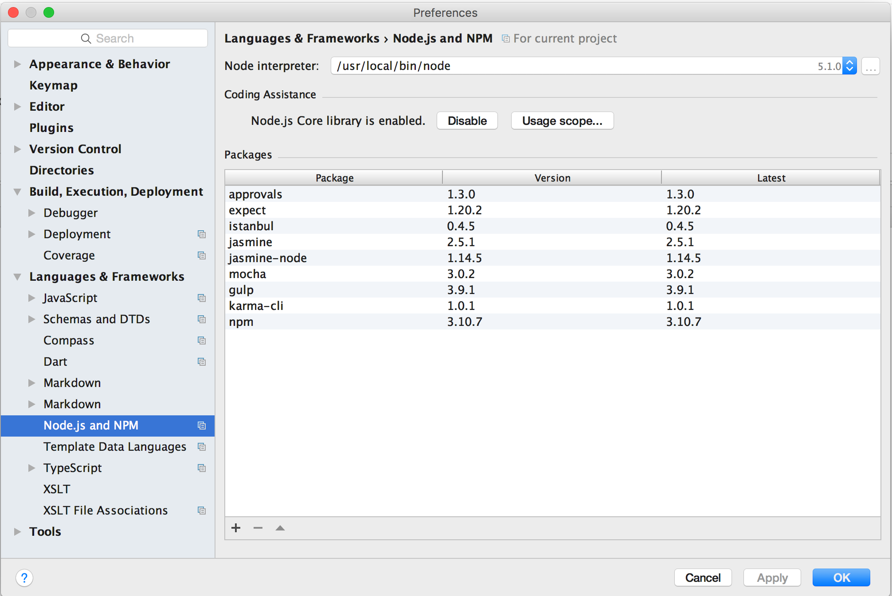
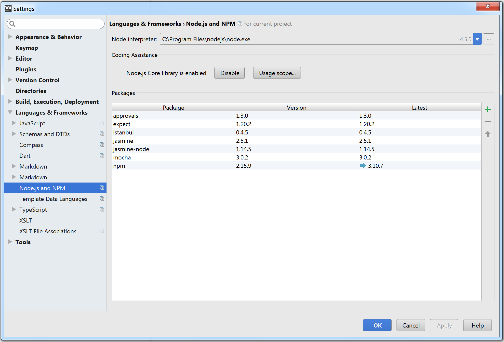

# Getting Started

## Install Node.js
These katas require that `Node.js` be installed. Go to the [node site](https://nodejs.org/) and following the install instructions for your operating system.
`npm`, the node package manager, will be installed when your install `Node.js`.

If you are running on Windows you will need to restart your computer in order for `Node.js` to work.

## Install Dependencies
Next, use `npm` to install dependencies for these katas:

```sh
cd <local "training" folder>/js
npm install
```

# Running Tests
[Mocha](https://github.com/mochajs/mocha) is used as the test framework for these katas. You specify the test(s) you want to run on the command line:

```sh
npm test bowling
```
If you are on Windows you may see the error `File sizes do not match` because of line ending differences. The fix is delete the `Gilded_Rose.should_update_items.approved.txt` file and rename the `Gilded_Rose.should_update_items.received.txt` file to `Gilded_Rose.should_update_items.approved.txt`.

On non-Windows systems you can also run your tests with code coverage:

```sh
npm run coverage gilded_rose
```
Open the Coverage report at [coverage/lcov-report/index.html](coverage/lcov-report/index.html) with your browser.

## Jasmine
Running tests with [Jasmine](http://jasmine.github.io/) works with some caveats.

First of all, it has been configured to run all specs in the `js` folder, so you can't specify the tests for individual katas.
 
Next, the Gilded Rose kata does run as expected due to an incompatability with the approvals library (it does not calculate the correct file name and looks for files with nothing before the `.approved.txt` or `received.txt`).

To run the tests with Jamsine:

```sh
npm run jasmine
```
Also, when you first run, you will see an error like `Approved file does not exist`. In the `gilded_rose` folder delete the `.approved.txt` file and rename the `.received.txt` file to `.approved.txt` and re-run.

## Webstorm IDE
[WebStorm](https://www.jetbrains.com/webstorm/specials/webstorm/webstorm.htm) is a great IDE with a free 30 day trial.
Out of the box, WebStorm provides IDE integration for Mocha, but not Jasmine. In this project you can still run Jamsine
tests through WebStorm via the `Jasmine` run configuration but this will run in a terminal window rather than use WebStorm unit test view.

### Enable Node.js
To run tests from the IDE you may need to enable `Node.js` if it is not already enabled.

On a Mac you do this by pressing **&#8984;,**, , selecting `Node.js and NPM` and press the `Enable` button if you see that Node.js is not enabled. The window should like the shown below:



On Windows you do this by entering `Ctrl+Alt+S`, selecting `Node.js and NPM` and press the `Enable` button if you see that Node.js is not enabled. The window should like the one shown below:



## Running Tests
Right click on any `spec.js` file and select "Run".

### Viewing Markdown Files
To view the kata descriptions it is recommended that you install the 'Markdown Support' plugin. Refer to the [Enabling and Disabling Plugins](https://www.jetbrains.com/help/webstorm/2016.2/enabling-and-disabling-plugins.html) if you need help with this.
